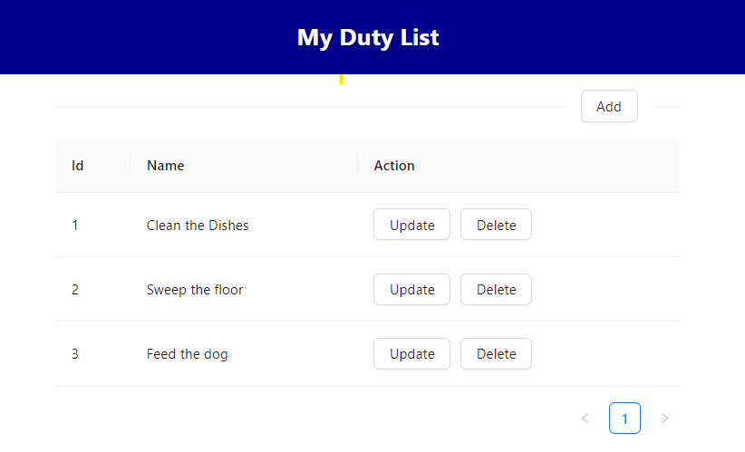
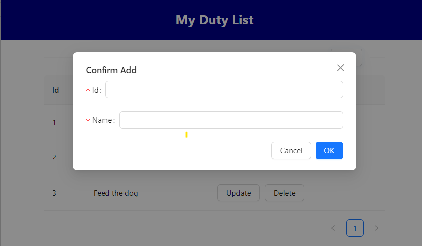
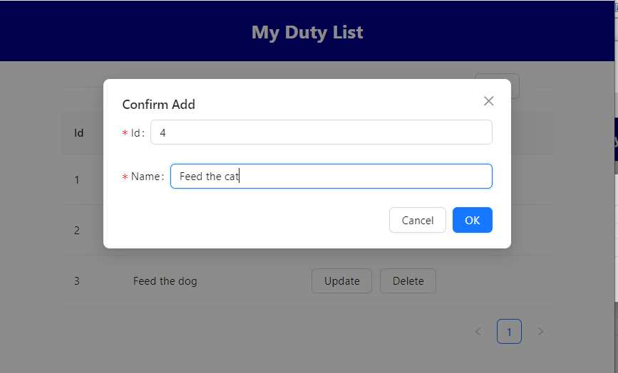
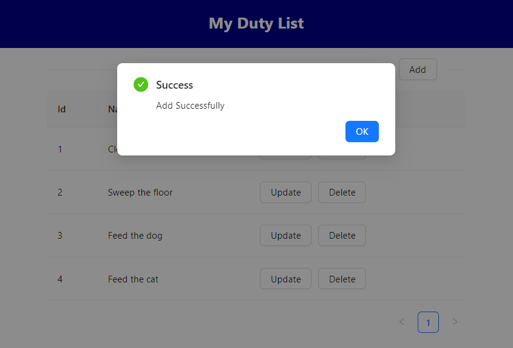
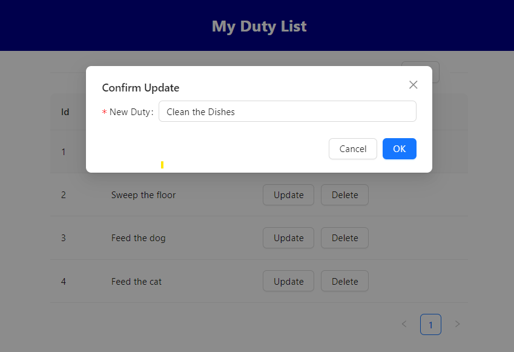
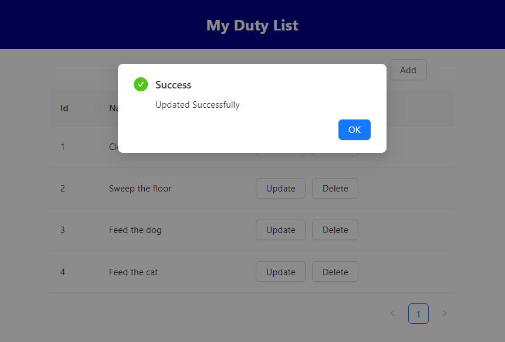
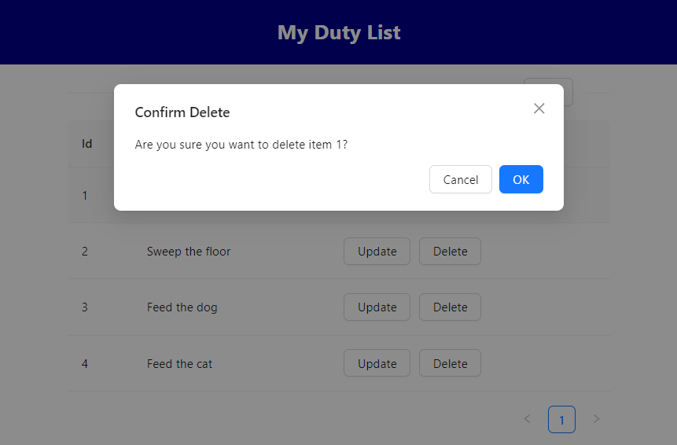
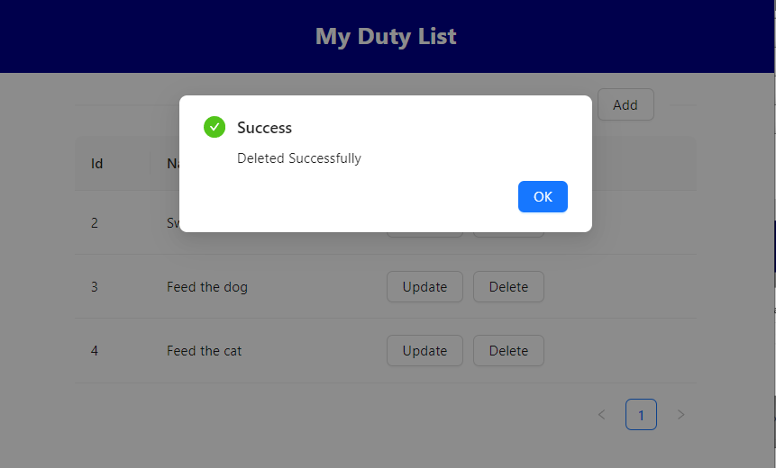

## Pre requisite: Postgres DB

Before running the apps, a postgres DB is needed for the data storage. 

The DB config can be set in `backend/src/db/dbClient.ts`


```
export const dbClient = new Client({
  host: 'localhost',
  port: 5432,
  user: 'postgres',
  password: 'mysecretpassword',
  database: 'myDB',
});
```

## How to run - Backend


Move to the backend folder
```bash
  cd backend
```

Install necessary dependencies
```bash
  npm install
```

Run in development mode
```bash
  npx ts-node index.ts
```

The backend server should now be up and running and listen to port 3000.

## How to run - Frontend
Move to the frontend folder
```bash
  cd frontend
```

Install necessary dependencies
```bash
  npm install
```


Run in PORT 5000
```bash
  PORT=5000 npm start
```


## Access to the App
After the backend frontend server are running, access http://localhost:5000 


## How to use

**The landing page consists of all your duties.**


**You can either do one of the following actions:**

1. Add a new Duty
2. Update the existing Duty
3. Delete the existing Duty

**1. Add a new Duty**





**2. Update the existing Duty**




**3. Delete the existing Duty**





